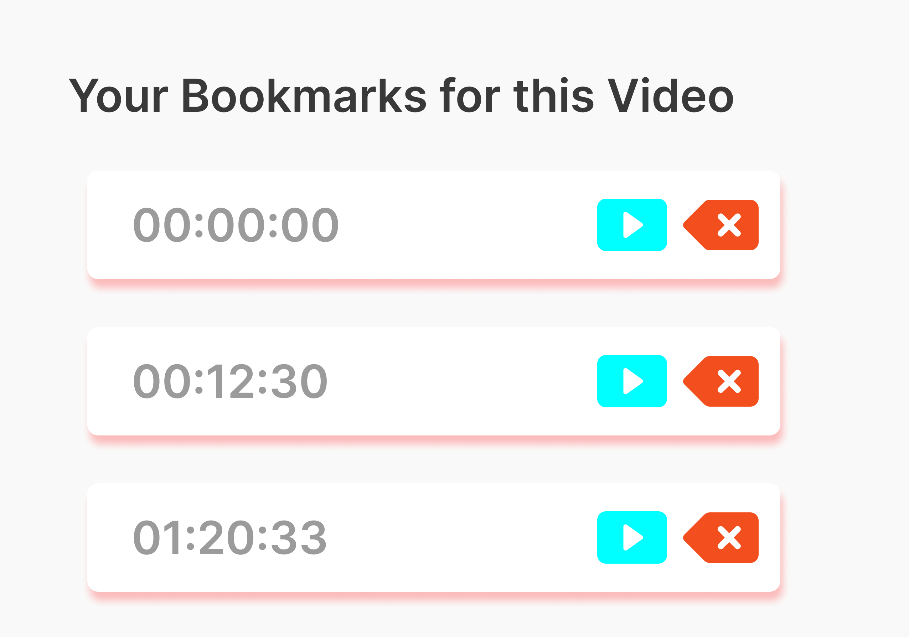

<h1 align="center">  <b> Youtube Timeline Bookmarker </b></h1>
<!-- PROJECT LOGO -->

<h2><b>📚 Bookmark timelines in Youtube videos</b></h2>

  

  
---

  

  
  

  
  # [DEMO LINK](https://yttb.netlify.app/)

## [Extension Code Link](https://github.com/Sriver27/YouTube-Timeline-Bookmarker)

<table>
  <tr>
    <td></td>
    <td></td>
  </tr>
  
</table>

---

## Tech Stack 💻

---

 

### Designed On:

## Contributors ✨

Thanks goes to these wonderful people ([emoji key](https://allcontributors.org/docs/en/emoji-key)):

<!-- ALL-CONTRIBUTORS-LIST:START - Do not remove or modify this section -->
<!-- prettier-ignore-start -->
<!-- markdownlint-disable -->
<table>
  <tr>
    <td align="center"><a href="https://github.com/Spyware007"> <b>OM GAWANDE</b></a> <a href="https://github.com/Spyware007/YouTube-Timeline-Bookmarker-Product-Page/commits?author=Spyware007" title="Code">💻</a> <a href="#data-Spyware007" title="Data">🔣</a> <a href="https://github.com/Spyware007/YouTube-Timeline-Bookmarker-Product-Page/commits?author=Spyware007" title="Documentation">📖</a> <a href="#maintenance-Spyware007" title="Maintenance">🚧</a></td>
    <td align="center"><a href="https://github.com/Sapna127"> <b>Sapna Kul</b></a> <a href="#design-Sapna127" title="Design">🎨</a> <a href="#content-Sapna127" title="Content">🖋</a> <a href="https://github.com/Spyware007/YouTube-Timeline-Bookmarker-Product-Page/pulls?q=is%3Apr+reviewed-by%3ASapna127" title="Reviewed Pull Requests">👀</a></td>
  </tr>
</table>

<!-- markdownlint-restore -->
<!-- prettier-ignore-end -->

<!-- ALL-CONTRIBUTORS-LIST:END -->

This project follows the [all-contributors](https://github.com/all-contributors/all-contributors) specification. Contributions of any kind welcome!
